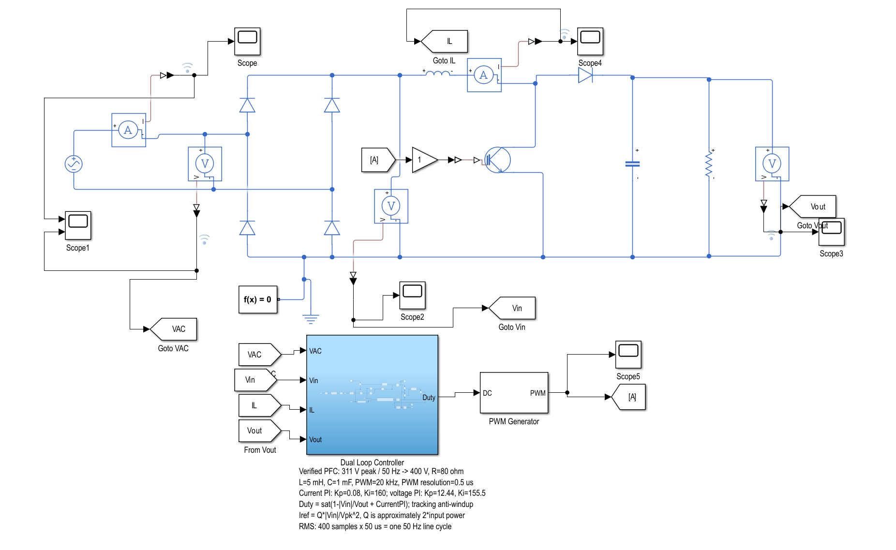
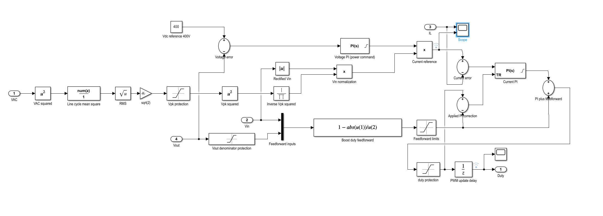
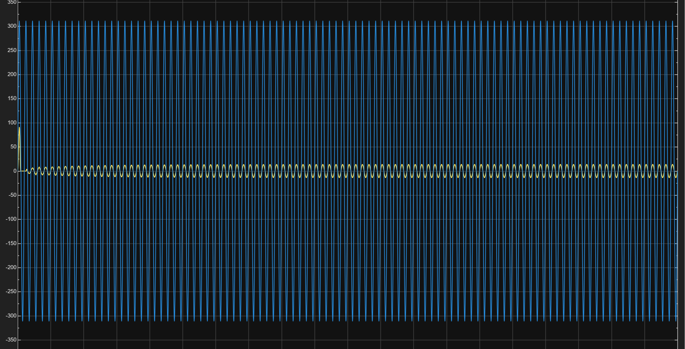
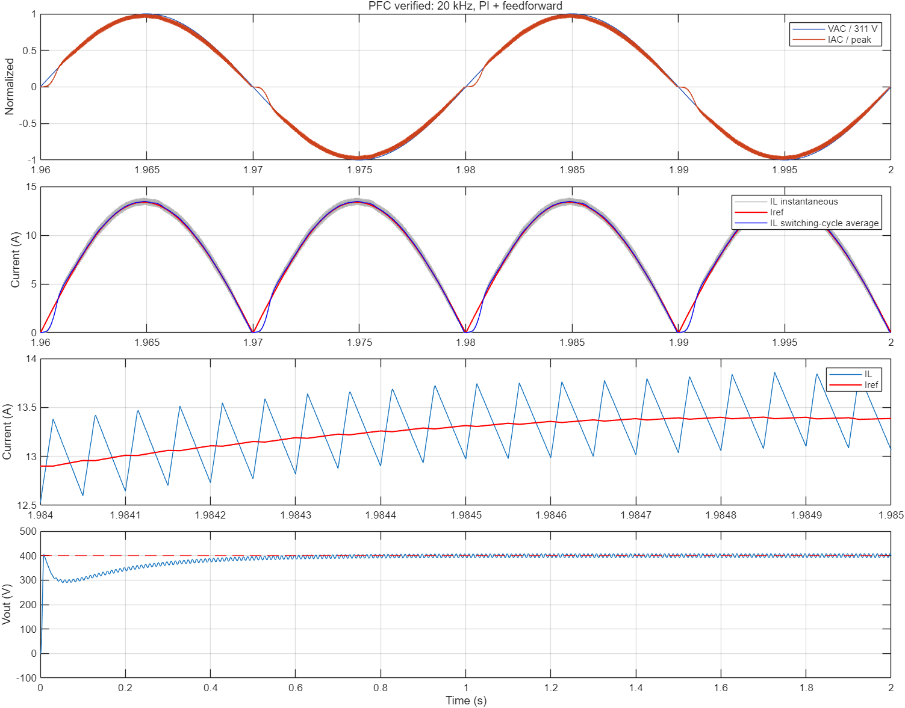

# Simulink Boost PFC 双闭环仿真

本项目使用 MATLAB/Simulink 和 Simscape Electrical 搭建单相 Boost 功率因数校正（PFC）系统。控制目标是将 220 V、50 Hz 交流输入升压并稳定到 400 V，同时让输入电流跟随输入电压，实现接近单位功率因数。

## 系统搭建

### 1. PFC 主电路



主电路按照以下顺序连接：

```text
220 V / 50 Hz 交流电源
        ↓
单相二极管整流桥
        ↓
Boost 电感（5 mH）
        ↓
IGBT 开关管 + Boost 二极管
        ↓
直流母线电容（1 mF）
        ↓
80 Ω 负载
```

在交流输入端、电感支路和直流输出端分别加入电压、电流传感器，得到 `VAC`、`Vin`、`IL` 和 `Vout`。控制器输出占空比，经 PWM Generator 产生 IGBT 的驱动信号。

### 2. 双闭环控制器



控制器由电压外环和电流内环组成：

1. 电压外环计算 `400 - Vout`，经过电压 PI 得到功率指令 `Q`。
2. 输入电压平方后，使用一个完整工频周期的滑动平均计算 RMS 和峰值 `Vpk`。
3. 根据整流输入电压生成正弦电流参考：

   ```text
   Iref = Q × |Vin| / Vpk²
   ```

4. 电流内环计算 `Iref - IL`，经过电流 PI 得到占空比修正量。
5. 使用 Boost 稳态关系计算占空比前馈：

   ```text
   Dff = 1 - |Vin| / Vout
   ```

6. 将前馈与 PI 修正量相加，限幅到 `0～0.95`，延迟一个控制周期后送入 PWM Generator。

最终控制关系为：

```text
Q    = VoltagePI(400 - Vout)
Vpk  = clamp(sqrt(2) × RMS(VAC), 250, 500)
Iref = Q × |Vin| / Vpk²
Dff  = clamp(1 - |Vin| / max(Vout, 50), 0, 0.95)
D    = clamp(Dff + CurrentPI(Iref - IL), 0, 0.95)
```

## 参数设置

| 模块 | 参数 |
|---|---:|
| 交流输入 | 311 V 峰值，50 Hz（约 220 V RMS） |
| 输出电压参考 | 400 V |
| Boost 电感 | 5 mH |
| 直流母线电容 | 1 mF |
| 负载 | 80 Ω |
| 电压 PI | Kp = 12.44，Ki = 155.5 |
| 电流 PI | Kp = 0.08，Ki = 160 |
| PWM 开关频率 | 20 kHz |
| PWM 采样时间 | 0.5 μs |
| 占空比范围 | 0～0.95 |
| RMS 窗口 | 400 点 × 50 μs = 20 ms |
| 最大求解步长 | 0.5 μs |
| 相对容差 | 1e-4 |

电流 PI 使用跟踪抗饱和：当最终占空比触及上下限时，积分器跟踪实际可用的 PI 修正量，避免积分继续累积。

## 仿真结果

### 输入电压与输入电流



图中蓝色为约 ±311 V 的交流输入电压，黄色为输入电流。由于两者量纲和幅值不同，显示在同一坐标轴时电流幅值较小；两者的过零点和峰值位置一致。

### 稳态波形与跟踪结果



从上到下分别为：

- 归一化后的交流电压与交流电流，两者基本同相、同形状；
- 瞬时电感电流、参考电流和开关周期平均电流；
- 展开的开关纹波；
- 400 V 直流母线的启动和稳态过程。

仿真时间为 2 s，下面的指标统计自最后 0.2 s，即 10 个完整工频周期：

| 指标 | 仿真结果 |
|---|---:|
| 输出平均电压 | **399.99 V** |
| 输出平均功率 | **2000.33 W** |
| 输入功率因数 | **0.9991** |
| 输入电流 THD（2～40 次谐波） | **3.30%** |
| IL 周期平均跟踪误差 | **2.96%** |
| 电流基波相对电压相位 | **0.34°** |
| 每开关周期 IL 峰峰值中位数 | **0.89 A** |
| 输出电压峰峰值 | **16.17 V** |

`Iref` 是每个开关周期的平均电流目标，`IL` 是包含高频开关纹波的瞬时电感电流。因此应比较 IL 的周期平均值和 Iref，不需要让两个瞬时波形完全重合。输出端保留约 100 Hz 的纹波，这是单相 PFC 二倍工频功率脉动造成的正常现象。

## 运行项目

环境要求：

- MATLAB R2025b
- Simulink
- Simscape
- Simscape Electrical

打开 `PFC_verified.slx` 后直接运行即可，默认仿真时间为 2 s。

也可以在 MATLAB 中进入仓库根目录并执行：

```matlab
stats = run_PFC_verified;
```

脚本会加载模型、运行仿真、计算最终指标，并生成验证波形和 CSV 结果。使用下面的命令可进行 1 s 快速复测：

```matlab
stats = run_PFC_verified(1);
```

## 项目文件

```text
PFC_verified.slx          完整 Simulink 模型
run_PFC_verified.m        自动仿真和指标计算脚本
corrected.png             最终验证波形
verification_metrics.csv 最终量化结果
assets/                   主电路、控制器和 Scope 截图
```

当前模型针对 311 V 峰值、50 Hz 输入和 80 Ω 固定负载完成验证，尚未覆盖宽输入范围、负载突变、器件热模型和硬件实验。
